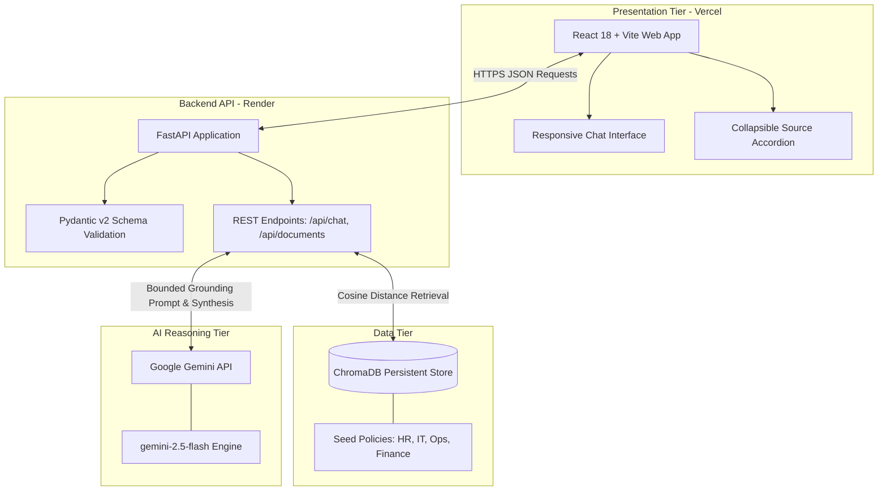
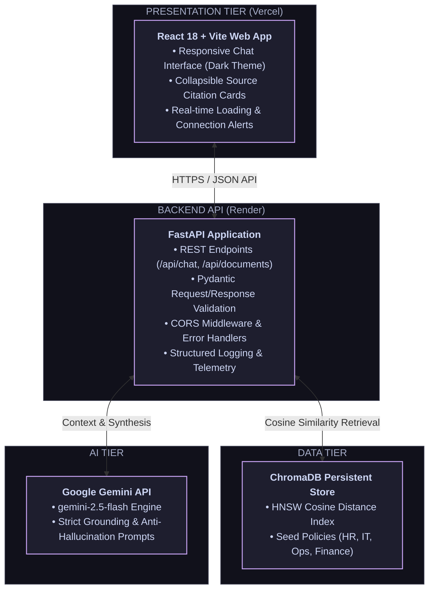
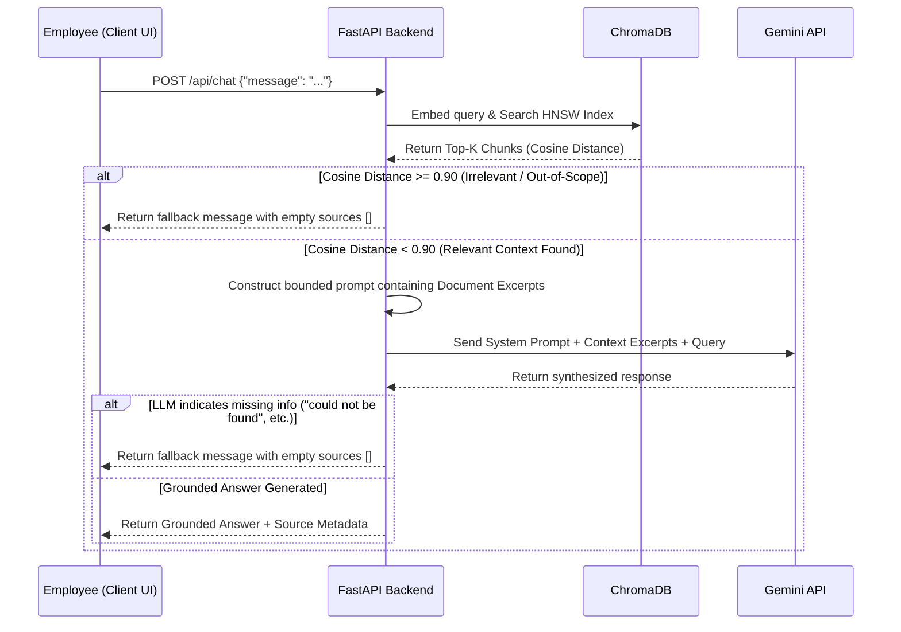

# Blacksmith Data · AI Knowledge Assistant

An end-to-end Retrieval-Augmented Generation (RAG) assistant designed for internal employees to query company policies, IT workflows, and onboarding guidelines with verifiable citations and strict hallucination guardrails.

---

## 🌐 Live Interactive Demo

Reviewers and team members can test the application live on mobile or desktop without local setup:

* **🚀 Live Web App (Frontend):** https://ai-knowledge-assistant-silk.vercel.app
* **📚 Interactive Swagger API Docs (Backend):** https://ai-knowledge-assistant-backend-6dtu.onrender.com/docs

> **Note on Free-Tier Hosting:** The backend is deployed on Render's free tier. If idle for 15 minutes, the instance spins down. The first query after spin-down may take ~30–45 seconds to wake the service; subsequent requests respond instantly.

---

## 1. Project Overview

The **Blacksmith Data AI Knowledge Assistant** provides employees with real-time, accurate answers to organizational questions (such as remote work rules, VPN setups, expense claims, and onboarding schedules).

### Key Highlights
* **Grounded Synthesis:** Formulates answers strictly using retrieved company policy documents.
* **Verifiable Source Attribution:** Displays collapsible citation badges with exact document titles and source excerpts.
* **Anti-Hallucination Guardrails:** Distinguishes between in-scope queries and undocumented questions, falling back safely without inventing policies.
* **Live Knowledge Base Management:** REST endpoints to dynamically query, index, and purge policy documents at runtime.

---

## 2. Architecture

The system enforces modular separation between the presentation tier, backend API routing, vector database persistence, and external LLM reasoning.

### Architecture Concept Map



### Visual Component Flow



---

## 3. Technology Choices

| Layer | Technology | Selection Rationale |
| :--- | :--- | :--- |
| **Frontend** | **React 18 + Vite** | Lightweight and fast dev setup with instant hot reloading, making UI iteration straightforward. |
| **Styling** | **Tailwind CSS** | Speeds up styling with utility classes, making it simple to build a clean, responsive dark-mode chat layout. |
| **Backend** | **FastAPI (Python)** | Simple async handling, automatic request validation with Pydantic, and built-in `/docs` Swagger support out of the box. |
| **Vector Store** | **ChromaDB** | Runs directly inside Python and persists to disk without needing to spin up a separate database server or Docker container. |
| **LLM Provider** | **Google Gemini (2.5 Flash)** | Fast response times, accurate context following to prevent hallucination, and generous free-tier limits. |
| **HTTP Client** | **HTTPX** | Handles asynchronous API calls to Gemini cleanly with custom timeouts and error fallbacks. |
| **Testing** | **Pytest + TestClient** | Fast, simple test execution for API endpoints, document CRUD, and RAG retrieval logic without heavy setup. |
---

## 4. Setup Instructions

### Prerequisites
* **Python 3.10+** (`python --version`)
* **Node.js 18+** & **npm** (`node -v` && `npm -v`)
* **Git** installed on your system
* A free **Google AI Studio API Key**

### Clone Repository
```bash
git clone [https://github.com/nrraleeya/ai-knowledge-assistant.git](https://github.com/nrraleeya/ai-knowledge-assistant.git)
cd ai-knowledge-assistant
```

---

## 5. Environment Variables

Create a `.env` file inside the `backend/` directory using the provided `.env.example`:

```bash
cd backend
cp .env.example .env
```

Set the required environment variables inside `backend/.env`:
```env
# Required: Google Gemini API Key from Google AI Studio
GEMINI_API_KEY=your_gemini_api_key_here

# Optional: Preferred model name (default: gemini-2.5-flash)
LLM_MODEL=gemini-2.5-flash
```

---

## 6. How to Run the Frontend

Open a terminal window and run:

```bash
# 1. Navigate to frontend directory
cd frontend

# 2. Install dependencies
npm install

# 3. Start development server
npm run dev
```

* **Frontend Local URL:** `http://localhost:5173`

---

## 7. How to Run the Backend

Open a separate terminal window and run:

```bash
# 1. Navigate to backend directory
cd backend

# 2. (Recommended) Activate virtual environment
python -m venv venv
# Windows:
.\venv\Scripts\activate
# macOS/Linux:
source venv/bin/activate

# 3. Install dependencies
pip install -r requirements.txt

# 4. Start the FastAPI server
python -m uvicorn main:app --host 0.0.0.0 --port 8000 --reload
```

* **Backend Local API:** `http://localhost:8000`
* **Swagger UI Documentation:** `http://localhost:8000/docs`
* **ReDoc Documentation:** `http://localhost:8000/redoc`

---

## 8. How to Run Tests

The automated test suite verifies API request schemas, document CRUD lifecycles, semantic vector retrieval, grounded answering, and unknown question guardrails.

Run pytest inside the `backend/` directory:
```bash
cd backend
pytest -v
```

Expected test output:
```text
test_app.py::test_document_retrieval_semantic_match PASSED        [ 16%]
test_app.py::test_document_retrieval_it_support PASSED            [ 33%]
test_app.py::test_get_all_documents_api PASSED                    [ 50%]
test_app.py::test_add_and_delete_document_lifecycle PASSED        [ 66%]
test_app.py::test_rag_in_scope_wfh_query PASSED                   [ 83%]
test_app.py::test_rag_out_of_scope_guardrail PASSED               [100%]

============================== 6 passed in 8.12s ==============================
```

---

## 9. API Documentation

### 1. Submit Chat Message
* **Endpoint:** `POST /api/chat`
* **Request Body:**
  ```json
  {
    "message": "What is the core working hours policy?"
  }
  ```
* **Success Response (`200 OK`):**
  ```json
  {
    "answer": "Core collaboration hours are 10:00 AM to 4:00 PM local time. Employees are expected to be available for team communications and scheduled meetings during this window.",
    "sources": [
      {
        "title": "Flexible & Remote Working Policy",
        "content": "Core collaboration hours are 10:00 AM to 4:00 PM local time..."
      }
    ]
  }
  ```

### 2. List All Indexed Documents
* **Endpoint:** `GET /api/documents`
* **Response (`200 OK`):**
  ```json
  [
    {
      "id": "doc-wfh-01",
      "title": "Flexible & Remote Working Policy",
      "category": "Human Resources",
      "content": "Employees may work remotely up to 3 days per week..."
    }
  ]
  ```

### 3. Add / Index a New Document
* **Endpoint:** `POST /api/documents`
* **Request Body:**
  ```json
  {
    "id": "doc-parking-01",
    "title": "Office Parking Policy",
    "category": "Facilities",
    "content": "Employee parking passes are available for Basement Level 2."
  }
  ```
* **Response (`201 Created`):**
  ```json
  {
    "id": "doc-parking-01",
    "title": "Office Parking Policy",
    "category": "Facilities",
    "content": "Employee parking passes are available for Basement Level 2."
  }
  ```

### 4. Delete a Document
* **Endpoint:** `DELETE /api/documents/{doc_id}`
* **Response (`200 OK`):**
  ```json
  {
    "message": "Document doc-parking-01 successfully deleted."
  }
  ```

---

## 10. RAG Implementation

### RAG Pipeline & Guardrail Sequence Diagram



### Retrieval & Guardrail Mechanics
1. **Document Ingestion & Seeding:** On startup, `rag_service.py` parses `knowledge_base/seed_documents.json` and upserts policies across HR, IT Support, Operations, and Finance into ChromaDB using cosine distance indexing.
2. **Semantic Vector Search:** For incoming questions, ChromaDB executes an approximate nearest neighbor search ($Top\text{-}K = 2$). A cosine distance cutoff threshold of $0.90$ filters out weakly correlated context.
3. **Bounded Context Prompting:** Retrieved document chunks are assembled into a structured system prompt that explicitly instructs the model to rely solely on the provided excerpts and avoid external assumptions.
4. **Hallucination Prevention (Unknown Question Handling):** When a user asks a question outside the knowledge base (e.g., *"What is the company maternity leave policy?"*), the pipeline:
   * Recognizes the knowledge gap via semantic distance or model fallback tokens.
   * Strips ungrounded citation cards (`sources: []`).
   * Returns a clean fallback response: *"I could not find any policy regarding that in our company knowledge base. Please consult HR or IT directly."*

---

## 11. Known Limitations

* **Transient Cold Starts (Free Tier):** Render spins down free backend web services after 15 minutes of inactivity, resulting in a 30–45s wake-up latency on initial cold requests.
* **Single-Chunk Document Ingestion:** Long seed documents are currently indexed as single blocks rather than recursive sliding character windows with chunk overlap.
* **Ephemeral Persistence in Cloud Containers:** Free cloud instances do not persist runtime dynamic vector updates across service redeployments unless attached to persistent storage disks or external vector cloud instances.

---

## 12. Potential Future Improvements

1. **Conversational Multi-Turn Memory:** Add session ID support with sliding-window dialogue history to handle contextual follow-up questions.
2. **Automated Document Ingestion Pipeline:** Create an admin upload dashboard supporting automated PDF, Markdown, and DOCX document parsing and chunking.
